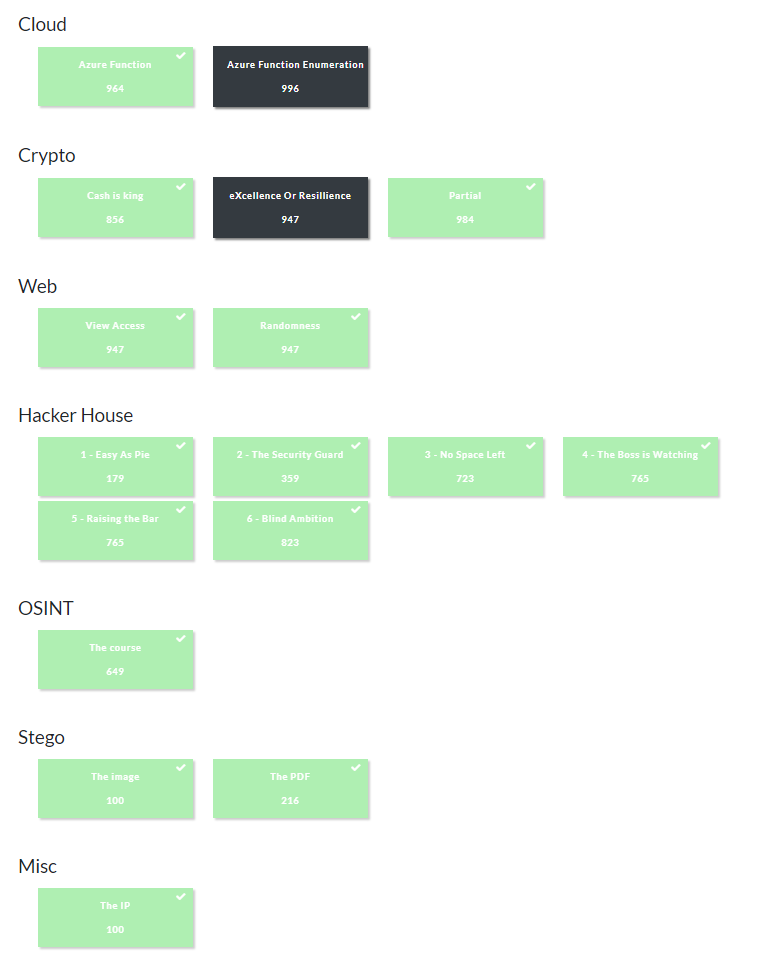

# Welcome to River Security's Easter CTF!

## We're excited to announce our Easter CTF, where participants can test their cybersecurity skills and compete for prizes!

# Rules

1. River Security's Easter challenge is intended to be a solo-based competition. Participants must not share flags or solutions with others.
2. Participants must not engage in any form of attack against the CTF infrastructure or other participants Do not attempt to ruin challenges by e.g. deleting flags.
3. Participants must follow any additional rules or guidelines provided by the organizers.
4. Organizers reserve the right to disqualify participants who violate the rules or engage in any form of unethical behavior.

# Additional challenges

Additional challenges might be added before the competition ends. However, these will be published no later than April 5th, 16:00 UTC. An announcement will be published on our Discord and on this platform

# End date

The CTF will end at Monday, April 10th 2023, 23:59:00 GMT+2.

# Flag Format

The flag format for River Security's Easter CTF is: RSXC{SOMETHING}

However, some challenges may have a different flag format, which will be explicitly stated in the challenge description.

Good luck and have fun!

# Challenges

