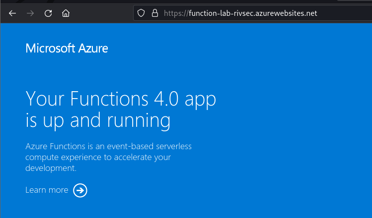
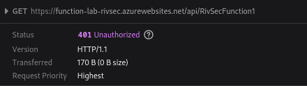
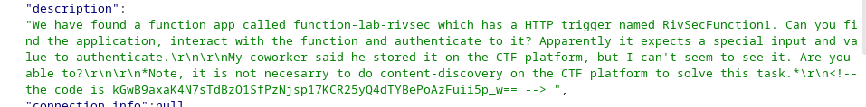
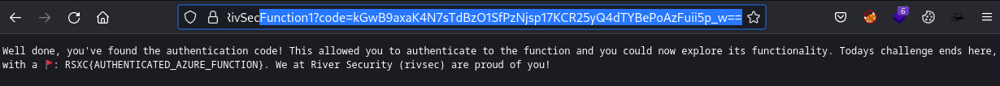

# Azure Function

We have found a function app called function-lab-rivsec which has a HTTP trigger named RivSecFunction1. Can you find the application, interact with the function and authenticate to it? Apparently it expects a special input and value to authenticate.

My coworker said he stored it on the CTF platform, but I can't seem to see it. Are you able to?

Note, it is not necesarry to do content-discovery on the CTF platform to solve this task.

# Solution

As the text tells us, the app is named "function-lab-rivsec" the should then be accessible at: https://function-lab-rivsec.azurewebsites.net/

The text says this app has a HTTP trigger named "RivSecFunction1", which means (according to several Azure Functions tutorials viewed) that this is similar to an API endpoint and should be accessible at: https://function-lab-rivsec.azurewebsites.net/api/RivSecFunction1

This however gives us a "401 Unauthenticated"

Going back to the challenge and looking for clues, we can find that there are some data hidden in the description with reference to a code. A code is one way to authenticate to an Azure Function App (according to all those tutorials)

Using this code with the APP we get the flag.

Flag: RSXC{AUTHENTICATED_AZURE_FUNCTION}

