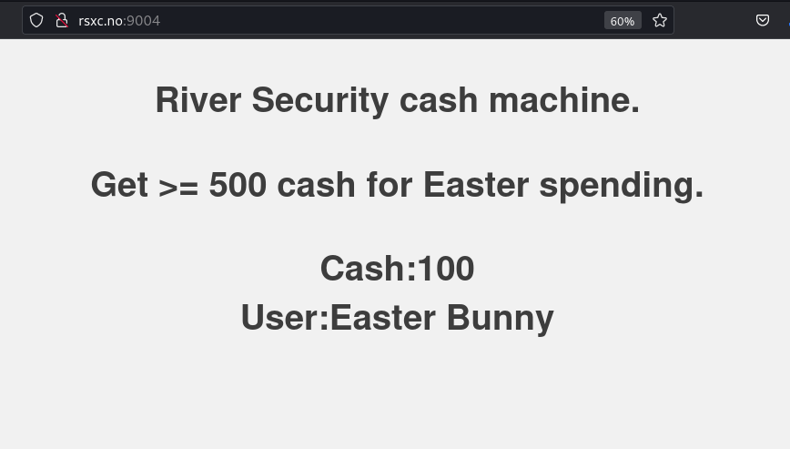
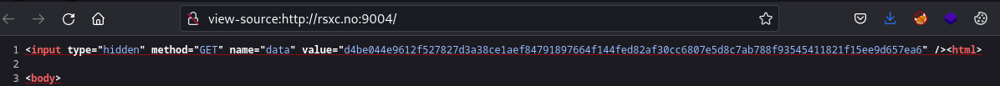
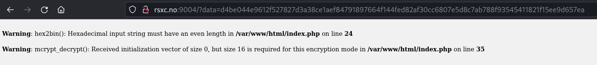
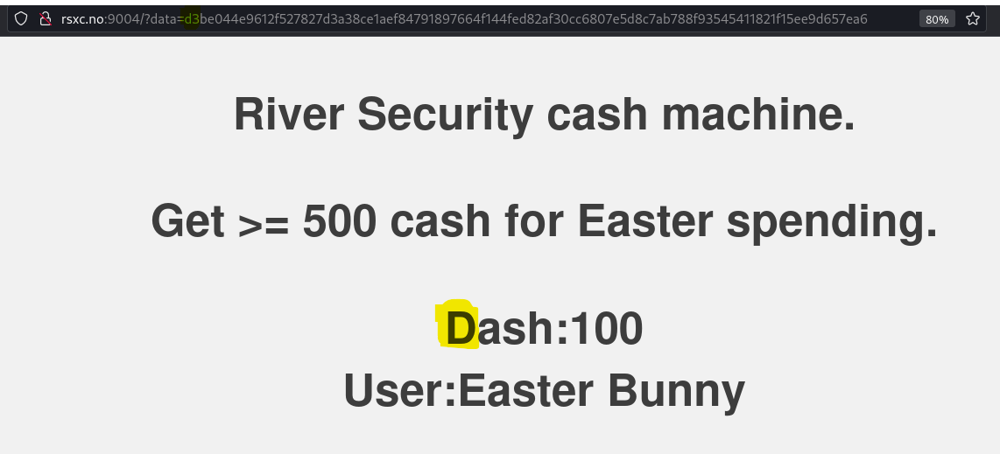
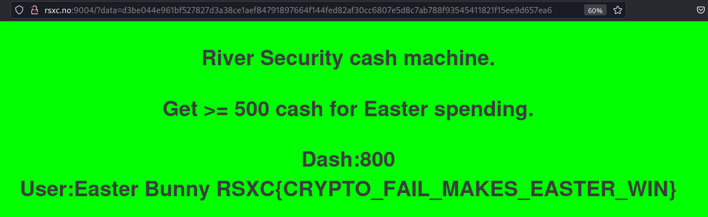

# Cash is king

Can you trick the system into giving you some more money?

# Solution

The page we are geeted with indicate we need to manipulate some data, giving ourself more money...

Looking at the source for the page, we can see a hidden field, data, with its value.

Using this in our GET request, we get the same page. If we try to remove one character from the data string, we get some errors displayed. Errors indicate that there is some hex-2-bin and mcrypt_decrypt in use. It also indicate that the IV of the cypto needs 16 bytes.

If we try to change the first byte of the data string, we see that the "Cash:100" is changed...

Changing the 6th byte should hopefully change the first digit for the cash. And is does... trying a bit before we start bruteforcing... on the 3rd try we get it... Changine the 6th byte from 12 to 1b...

Flag: RSXC{CRYPTO_FAIL_MAKES_EASATER_WIN}