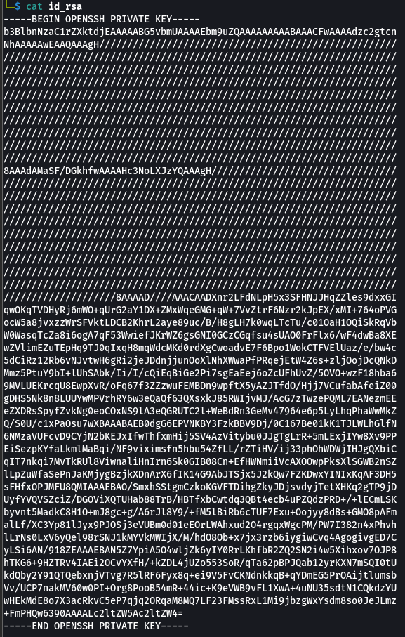
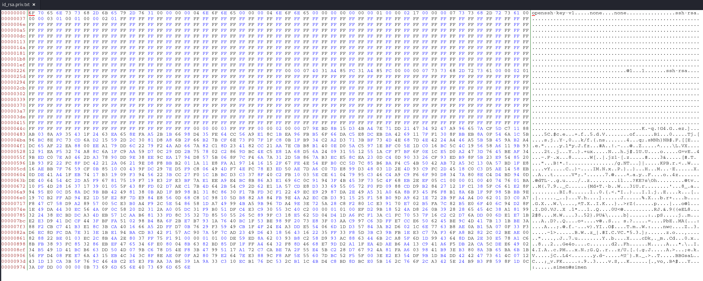
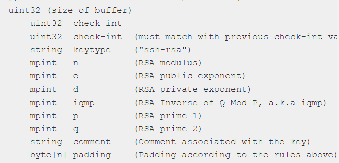
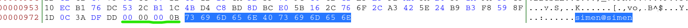

# Partial

We intercepted this encrypted flag, and we previously gathered this rsa key but something seems off. Can you help us decrypt it?

Files: id_rsa, flag.encrypted

# Solution

IPPSEC had a video about recreating SSH keys from leaked images. Ref: https://www.youtube.com/watch?v=4F1XGsvB2iA

So following what was seen in the video we can extract needed values from the id_rsa file we have and generate a new private key that should work.

The original file where much of the data is redacted..



Extract data from partial id_rsa.

```
$ cat id_rsa| grep -v "^---" | base64 -d > id_rsa.priv.txt
```

The we can use "bless" to view the file and find our values based on where they are located.



As it seems that there are no padding at the end, the last data is the comment according to the structure of the data: Ref: https://dnaeon.github.io/openssh-private-key-binary-format/




The Comment:



Using the ssh key structure we can extract the values of q, p, iqmp, and d. All other seems redacted. But p and q might be enough. We need the exponent, e, but this is usually defaulted to the value 65537.

We can now use the RsaCtfTool and generate a new private key and the use openssl util to decrypt the flag.

```
─$ python ./RsaCtfTool.py -p 0x00EFD29B18524AD8260B39282865454C38A18199322438ECBDDCA34DEB571CAAB68133FD8C35327D855055265C899FC318E5625D04D41DA6FCF13AC1FC70537F16C2C2D76ADD006DE1E71BE2E3D941DCCF443FBFFA510298B48A6F2BE7B7931A7640BC1F53BE989F2073E83F03AAC997C63DFFE7CCE6506245BE9C4D417B131BBE3A88F2CBC741B3E18C3BCA401666A52DFFD70B7629F35949CB1F4F24E4A3DDE554066D1DD357843AB2D6021C6E7763B8AE0AB15A070F33F3D6EC8DFCDA7E313E1BE194BACDB342F157AC907A5F7CAD2349D643185643162235FF33F85D3BC39BFB1EE3C77AF36FA8B2822C02BEAE00828822BE0103EC2C8B4A2E8037FF75F191 -q 0x00DE59ED8A620393B8C258D993AC8863446B2CA85F6D1D9943648DDA2E30E578A1C68BFB3893FC853286EBEF4765346FE080048B6382BD85DF1FFFA46432F88D4668E79DD2A11FEA4DAEB6A413C941A6F5DB2ACA5CDEE6490234B5491D41BCB663DD504D079BC678D54EF83B47995117A172C7CABE7A2F55E45BC228D767924A81FAA6039841B93EB3808A3B65BA6B1B56FFD408FEE76A4315EB4C343C8F8EAE0F0FA28079E2647EE3889CF8AF5E55607DBC52F55F003EE2E354DF9B1DB4DD42424773614C0712431D13CA3B5F769C464BC2E5E3FBAA3AB6391A9A33C310ECB176DC532CB11C4BD4C8BD8DBCE05B162C766F2CA3425E24B9B3F8598F1D0C3ADFDD -e 65537 --private

# Save the new key as "new-key"

─$ openssl pkeyutl -decrypt -inkey ./new-key -in flag.encrypted -out flag.decrypted.txt

cat flag.decrypted.txt
```

Flag: RSXC{You_managed_to_figure_out_how_SSH_keys_work}