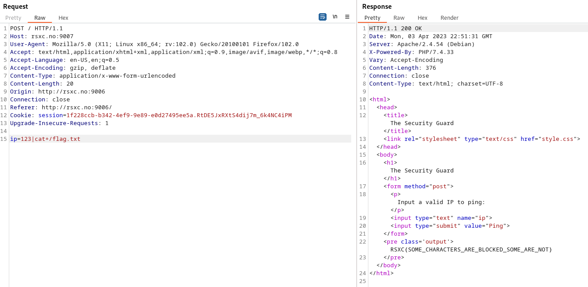

# 2 - The Security Guard

Once in a remote Norwegian town, a group of skilled security professionals had convened in a fancy cabin to collaborate and achieve their objectives. On their network, they found a number of challenges that required their collective expertise. Do you have what it takes to tackle these challenges too?

# Solution

Semicolon to end the command and start a new is blocked. But one "pipe" is enough to bypass. We could otherwise have used "||"

Flag: RSXC{SOME_CHARACTERS_ARE_BLOCKED_SOME_ARE_NOT}