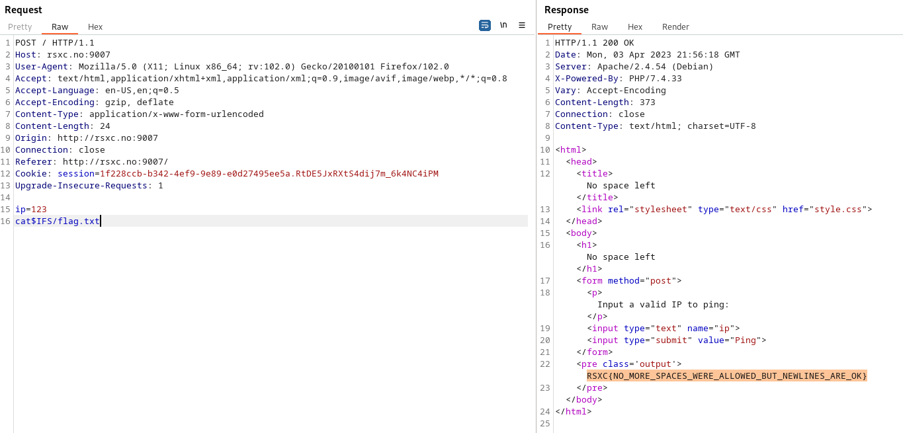

# 3 - No Space Left

Once in a remote Norwegian town, a group of skilled security professionals had convened in a fancy cabin to collaborate and achieve their objectives. On their network, they found a number of challenges that required their collective expertise. Do you have what it takes to tackle these challenges too?

# Solution

A new line and the use of "$IFS" (Internal Field Separator) is needed.

Flag: RSXC{NO_MORE_SPACES_WERE_ALLOWED_BUT_NEWLINES_ARE_OK}

