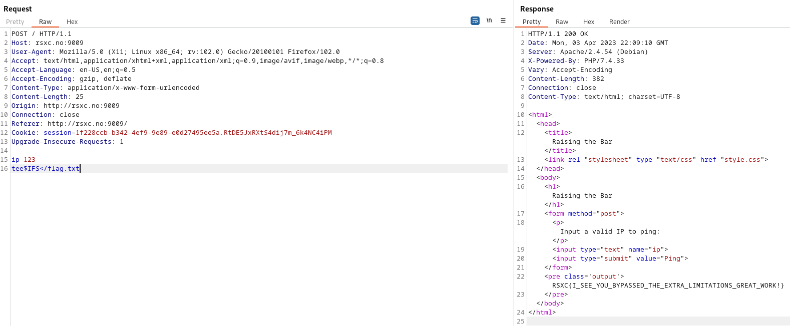

# 5 - Raising the Bar

Once in a remote Norwegian town, a group of skilled security professionals had convened in a fancy cabin to collaborate and achieve their objectives. On their network, they found a number of challenges that required their collective expertise. Do you have what it takes to tackle these challenges too?

# Solution

The same solution as challenge "4 - The Boss is watching".

Flag: RSXC{I_SEE_YOU_BYPASSED_THE_EXTRA_LIMITATIONS_GREAT_WORK!}