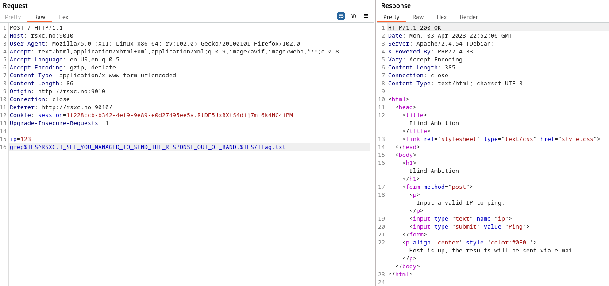

# 6 - Blind Ambition

Once in a remote Norwegian town, a group of skilled security professionals had convened in a fancy cabin to collaborate and achieve their objectives. On their network, they found a number of challenges that required their collective expertise. Do you have what it takes to tackle these challenges too?

# Solution

As we get output of "Host is up, the results will be sent via e-mail." if the command is successful we can do this blind... as the challenge name hints..

Using Burp Intruder we can brutforce our way to the flag and in the end we have the whole flag.

Flag: RSXC{I_SEE_YOU_MANAGED_TO_SEND_THE_RESPONSE_OUT_OF_BAND}