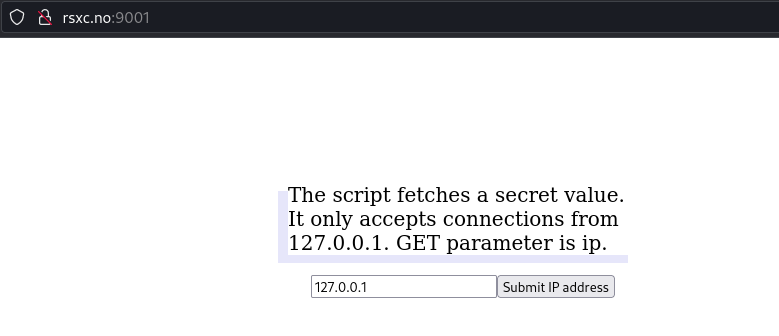
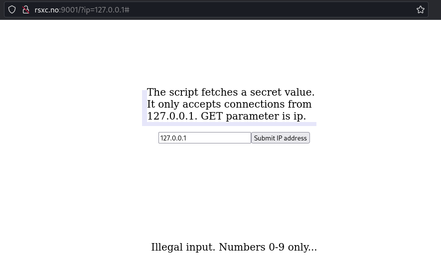
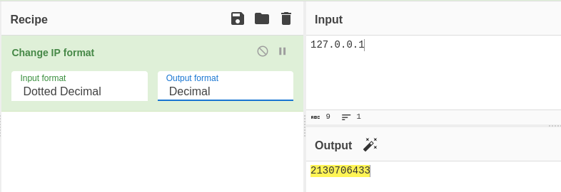
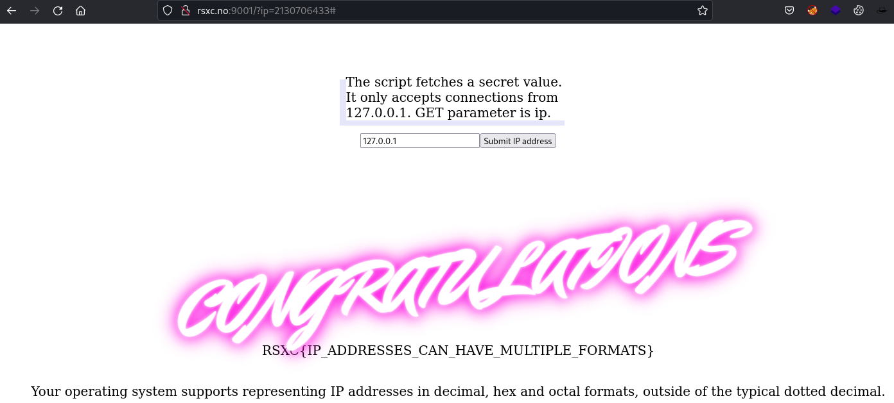

# The IP

Can you figure out how to bypass the filter and get the flag?

# Solution

The challenge tells us that there is a filter we need to bypass. Accessing the site, we are greeted with the following screen.

When we try to submit an IP address for lookup we get an error: "Illegal input. Numbers 0-9 only..."

As an IP address can be represented several ways; Dotted format, Decimal, Hex, Ocatal. CyberChef can help us change the format.

Using the Decimal format for the IP, and we get the flag.

Flag: RSXC{IP_ADDRESSES_CAN_HAVE_MULTIPLE_FORMATS}