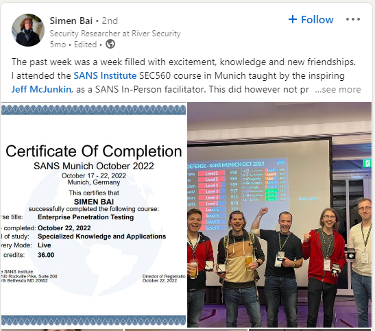
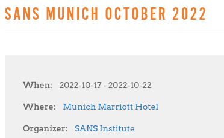
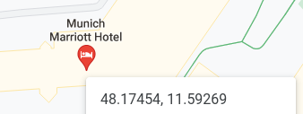
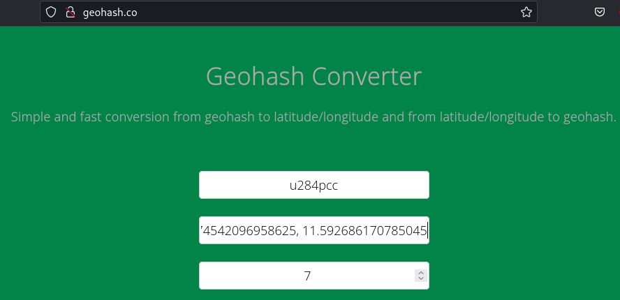

# The course

Last autumn (2022) one of our employees attended a course. Can you figure out who, and where?

The format of the flag (all lower case) is: <firstname>:<geohash> The geohash will be 7 characters long.

Example of flag format: mary:uqnx9ef

# Solution

River Security should most definitivitly have made a LinkedIn post about this, so off to search... and the search bears fruit...

So Simen Bai attended Sans Munich 2022. The question is where in Munich?

Google is our friend and give us the answer

Now we need to get the GeoHash for the Munich Marriott Hotel. According to Google Maps we get the Lat ang Lng : 48.174542096958625, 11.592686170785045

Using the site, http://geohash.co/, we get the GeoHash: u284pcc

And we should now have the flag: simen:u284pcc

Flag: simen:u284pcc