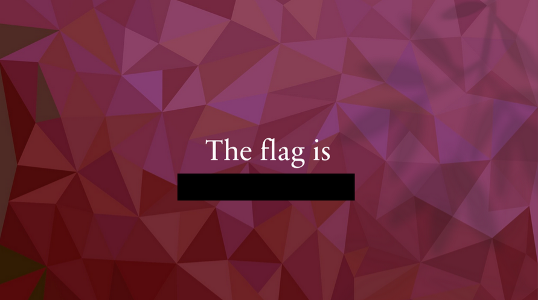
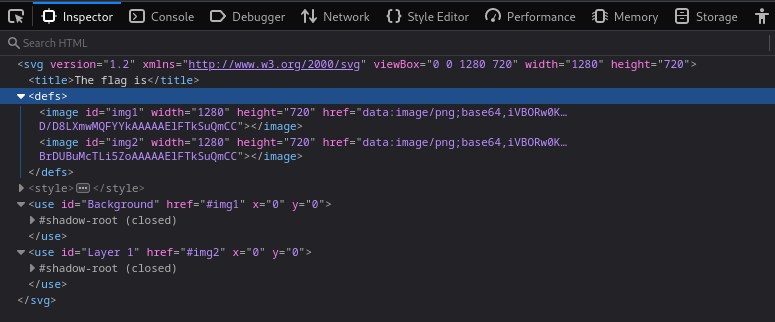
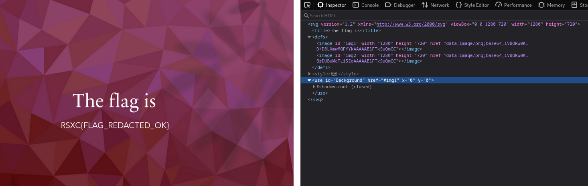
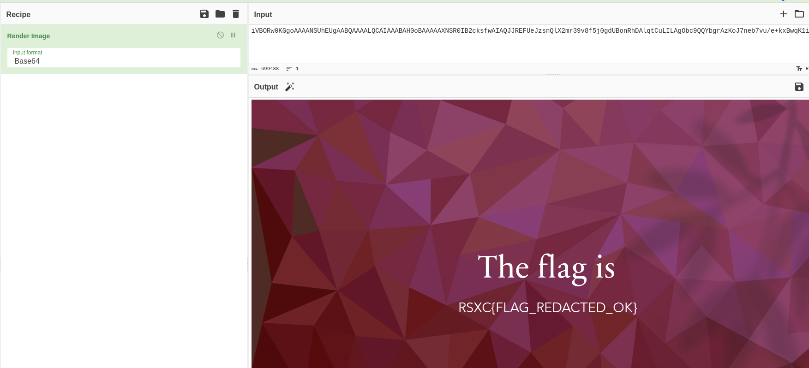

# The image

We found this image on a website, and there seems to be something redacted. Could you help us figure out what they tried to hide?

File: image.svg

# Solution

The file extension is SVG.

An SVG (Scalable Vector Graphics) file can opened by one of any browser or an image tool like Inkscape, Photoshop, Illustrator, or GIMP.

A browser is something we all have, so let us start with thet...

So the flag is redacted, as the hint says... Lets inspect this in the browser and see if we can find anything.

So we do actually have two images or layers. We could extract the base64 string and have cyberchef create an image for us, decode the base64 code ourself and pipe it out to an image file... Or we can just use the browser and delete the "Layer 1" image so that we only see the "Background" layer...

Flag: RSXC{FLAG_REDACTED_OK}

CyberChef alternative: Use the base64 image representation and create the image

