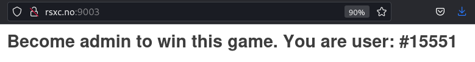
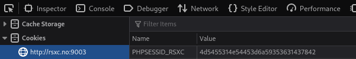
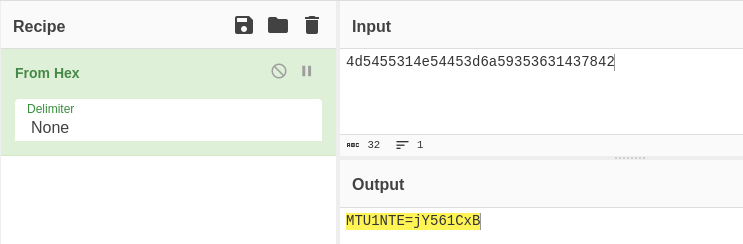
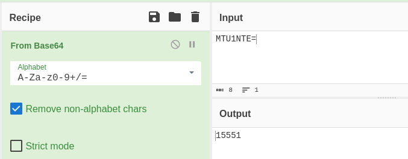
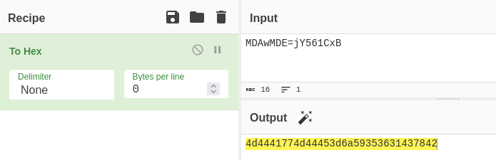
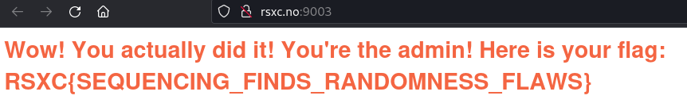

# Randomness

Become the admin user

http://rsxc.no:9003 

# Solution

The page do not tell us much, other than that we need to become admin. The user # might indicate that we need to manipulate this and get the User# for the admin; 00001?

If we look at the site and source we do not find anything. The only thing I can find that sticks out is a new cookie item: PHPSESSID_RSXC

Let CyberChef decode this value into hex... and the output looks like base64 string and some jobberish...

Lets take the string that looks like base64 and decode it

And there we have our User# 15551.

So doing this in revers should hopefully give is the flag...

Base64 encode 00001 gives "MDAwMDE=". Then add the same jobberish to get "MDAwMDE=jY561CxB". Code this string as Hex, which should be our cookie value for admin... "

Replace the cookie value and reload the page...

Flag hints about sequencing... maybe Burp Sequencer could have helped..

Flag: RSXC{SEQUENCING_FINDS_RANDOMNESS_FLAWS}